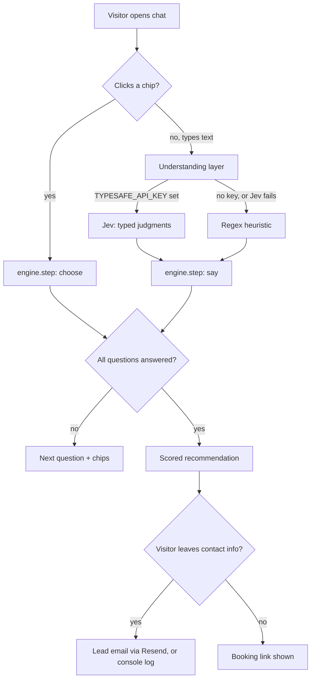

# How it works



## The core idea

The chat never asks an LLM to write a sentence. Every message the visitor sees comes from
`chat.config.ts` — written once, by you, in advance. The AI's only job is **understanding**:
given the visitor's free text and the conversation state, it returns typed judgments —
probabilities and choices — never prose.

```
"We need an online store live in two weeks, pretty urgent"
        │
        ▼
  { intent: "answer",
    guard: { jailbreak: 0.01, offTopic: 0.02, abuse: 0.0 },
    slots: { project: { value: "shop", confidence: 0.94 },
             timeline: { value: "asap", confidence: 0.91 } } }
        │
        ▼
  engine.ts turns this into pre-written replies from chat.config.ts
```

Because the model can only ever pick from a closed set of labels, there is no sentence for a
prompt injection to produce. The worst a jailbreak attempt can do is get itself correctly
classified as `jailbreak: 0.95` and receive your own canned refusal.

## Pieces

- **`src/lib/chat/engine.ts`** — pure `(state, event) -> (state, messages)` reducer. All
  policy (thresholds, turn limits, strikes) lives here as plain, readable code.
- **`src/lib/chat/jev.ts`** — builds the TypeSafe Jev request (`noul`/`choice` questions) from
  your config, and parses the typed response back into an `Understanding`.
- **`src/lib/chat/heuristic.ts`** — a regex-based understander with the same interface as Jev.
  Used when `TYPESAFE_API_KEY` is unset, or if a Jev call throws.
- **`src/lib/chat/understand.ts`** — picks Jev or the heuristic, and always runs the
  heuristic's guard checks too (defense in depth, zero marginal cost).
- **`src/lib/chat/session-token.ts`** — the entire conversation state is a JSON blob, HMAC-signed
  and handed back to the client. No database, no server-side session store.
- **`src/lib/chat/handler.ts`** — the HTTP handler, dependency-injected for testing.
- **`src/lib/chat/scoring.ts`** — turns finished answers into a score, a grade, and a
  recommendation, all defined by `chat.config.ts`.
- **`src/lib/chat/lead-email.ts`** — sends (or logs) the lead notification once contact
  details are submitted.

## Cost

A Jev call is a handful of small typed questions, not a generated response — fractions of a
cent per message. See [TypeSafe's pricing](https://typesafe.ai) for current numbers. Without a
key, understanding is free (regex only).
